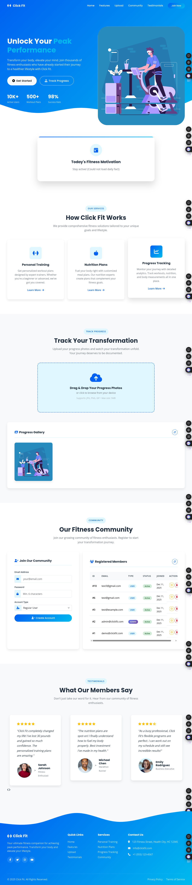

# Click Fit 💪

A modern fitness website built with HTML, CSS, JavaScript, Bootstrap, jQuery, Node.js, and MySQL.


## ✨ Features

- **Responsive Design** - Mobile-first approach with Bootstrap 5
- **Hero Section** - Eye-catching landing with animated stats
- **Daily Fitness Fact** - AJAX integration with Numbers API
- **Services Showcase** - Animated service cards
- **Image Upload** - Drag & drop with preview and gallery
- **User Management** - Register users via stored procedure
- **Testimonials** - Owl Carousel slider
- **Modern UI** - Gradient themes, animations, and smooth scrolling

## 🛠️ Tech Stack

### Frontend
- HTML5 & CSS3
- Bootstrap 5.3.2
- jQuery 3.7.1
- Owl Carousel 2.3.4
- Font Awesome 6.5.1

### Backend
- Node.js
- Express.js 4.18.2
- Multer (file uploads)
- mysql2 (database)
- CORS

### Database
- MySQL 8.x
- Stored Procedures

## 📁 Project Structure

```
Click-Fit/
├── assets/
│   └── images/
├── css/
│   ├── variables.css      # CSS custom properties
│   ├── base.css           # Reset & typography
│   ├── components.css     # Buttons, cards, forms
│   ├── sections.css       # Page sections
│   ├── animations.css     # Keyframe animations
│   └── responsive.css     # Media queries
├── js/
│   ├── config.js          # Configuration constants
│   ├── api.js             # AJAX API calls
│   ├── upload.js          # Drag & drop upload
│   ├── gallery.js         # Image gallery & lightbox
│   ├── users.js           # User management
│   ├── animations.js      # Scroll animations
│   └── main.js            # App initialization
├── server/
│   ├── config/
│   │   ├── config.js      # Server configuration
│   │   ├── database.js    # MySQL connection & init
│   │   └── multer.js      # File upload config
│   ├── routes/
│   │   ├── index.js       # Route aggregator
│   │   ├── upload.js      # Upload endpoints
│   │   └── users.js       # User CRUD endpoints
│   ├── middleware/
│   │   └── errorHandler.js
│   └── server.js          # Express app entry
├── database/
│   └── schema.sql         # Database schema
├── upload_images/         # Uploaded files
├── index.html             # Main HTML file
├── package.json
└── README.md
```

## 🚀 Getting Started

### Prerequisites

- Node.js 18+
- MySQL 8.x
- npm or yarn

### Installation

1. **Clone the repository**
   ```bash
   git clone https://github.com/HaroonTaufiq/Click-Fit.git
   cd Click-Fit
   ```

2. **Install dependencies**
   ```bash
   npm install
   ```

3. **Configure MySQL**
   
   Make sure MySQL is running:
   ```bash
   # Linux (Fedora/RHEL)
   sudo systemctl start mysqld
   
   # macOS (Homebrew)
   brew services start mysql
   
   # Windows
   net start mysql
   ```

4. **Update database credentials** (if needed)
   
   Edit `server/config/config.js`:
   ```javascript
   DB: {
       host: 'localhost',
       user: 'root',
       password: 'your_password',
       database: 'clickfit'
   }
   ```

5. **Start the server**
   ```bash
   npm start
   ```

6. **Open in browser**
   ```
   http://localhost:3000
   ```

## 📡 API Endpoints

### Upload
| Method | Endpoint | Description |
|--------|----------|-------------|
| POST | `/api/upload` | Upload single image |
| POST | `/api/upload/multiple` | Upload multiple images |
| GET | `/api/upload/list` | List all images |
| DELETE | `/api/upload/:filename` | Delete an image |

### Users
| Method | Endpoint | Description |
|--------|----------|-------------|
| GET | `/api/users` | Get all users |
| GET | `/api/users/:id` | Get user by ID |
| POST | `/api/users` | Create user (uses stored procedure) |
| PUT | `/api/users/:id` | Update user |
| DELETE | `/api/users/:id` | Delete user |

### Health
| Method | Endpoint | Description |
|--------|----------|-------------|
| GET | `/api/health` | Server health check |

## 🗄️ Database Schema

### Users Table
```sql
CREATE TABLE users (
    id INT AUTO_INCREMENT PRIMARY KEY,
    email VARCHAR(255) UNIQUE NOT NULL,
    password VARCHAR(255) NOT NULL,
    user_type ENUM('user', 'admin') DEFAULT 'user',
    is_active BOOLEAN DEFAULT TRUE,
    created_at TIMESTAMP DEFAULT CURRENT_TIMESTAMP,
    updated_at TIMESTAMP DEFAULT CURRENT_TIMESTAMP ON UPDATE CURRENT_TIMESTAMP
);
```

### Stored Procedure
```sql
CALL addUser('email@example.com', 'password123', 'user');
```

## 🎨 Color Scheme

| Color | Hex | Usage |
|-------|-----|-------|
| Primary Blue | `#0061f2` | Buttons, links |
| Secondary Blue | `#00baee` | Gradients, accents |
| Dark | `#1a1a2e` | Text, headers |
| Light | `#f8f9fa` | Backgrounds |

## 📱 Responsive Breakpoints

- **Mobile**: < 576px
- **Tablet**: 576px - 992px
- **Desktop**: > 992px

## 🧪 Development

```bash
# Run with nodemon (auto-restart)
npm run dev

# Production
npm start
```

## 🚀 Deployment

### Environment Variables

Create a `.env` file based on `.env.example`:

```bash
cp .env.example .env
```

Required environment variables:
| Variable | Description | Example |
|----------|-------------|---------|
| `PORT` | Server port | `3000` |
| `NODE_ENV` | Environment | `production` |
| `DB_HOST` | MySQL host | `localhost` |
| `DB_USER` | MySQL user | `root` |
| `DB_PASSWORD` | MySQL password | `your_password` |
| `DB_NAME` | Database name | `clickfit` |
| `FRONTEND_URL` | Frontend URL for CORS | `https://yoursite.netlify.app` |

### Option 1: Railway (Recommended - Full Stack)

Railway is the easiest option as it supports both Node.js and MySQL.

1. **Create Railway Account**: [railway.app](https://railway.app)

2. **Deploy from GitHub**:
   - Connect your GitHub repo
   - Railway auto-detects Node.js
   
3. **Add MySQL Database**:
   - Click "New" → "Database" → "MySQL"
   - Copy the connection variables

4. **Set Environment Variables**:
   ```
   DB_HOST=<from Railway>
   DB_USER=<from Railway>
   DB_PASSWORD=<from Railway>
   DB_NAME=<from Railway>
   NODE_ENV=production
   FRONTEND_URL=https://your-app.up.railway.app
   ```

5. **Update Frontend Config**:
   Edit `js/config.js` and set `API_BASE_URL` to your Railway URL.

### Option 2: Render (Free Tier Available)

1. **Backend on Render**:
   - Create Web Service from GitHub
   - Build Command: `npm install`
   - Start Command: `npm start`
   - Add environment variables

2. **Database**: Use [PlanetScale](https://planetscale.com) (free MySQL)

3. **Frontend on Netlify/GitHub Pages**

### Option 3: Netlify (Frontend) + Railway (Backend)

**Frontend (Netlify/GitHub Pages)**:
1. Push to GitHub
2. Connect to Netlify
3. Build settings: Leave empty (static site)
4. Before deploying, update `js/config.js`:
   ```javascript
   const API_BASE_URL = 'https://your-backend.railway.app';
   ```

**Backend (Railway)**:
- Follow Railway steps above

### Option 4: GitHub Pages (Frontend Only)

> ⚠️ GitHub Pages only serves static files. Backend features (upload, users) won't work without a separate backend.

1. Go to repo Settings → Pages
2. Select branch: `main`, folder: `/ (root)`
3. Your site: `https://haroontaufiq.github.io/Click-Fit/`

### Quick Deploy Checklist

- [ ] Update `js/config.js` with production `API_BASE_URL`
- [ ] Set environment variables on hosting platform
- [ ] Ensure MySQL database is accessible
- [ ] Test CORS settings match your frontend URL



## 👤 Author

**Haroon Taufiq**
- GitHub: [@HaroonTaufiq](https://github.com/HaroonTaufiq)

---

⭐ Star this repo if you found it helpful!
